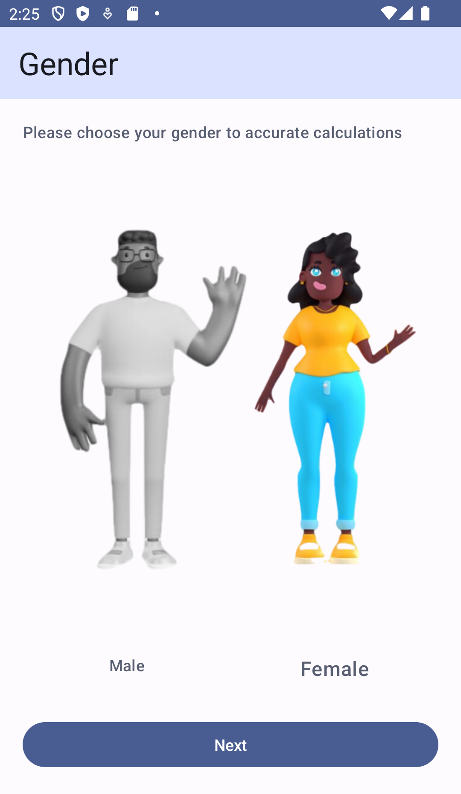
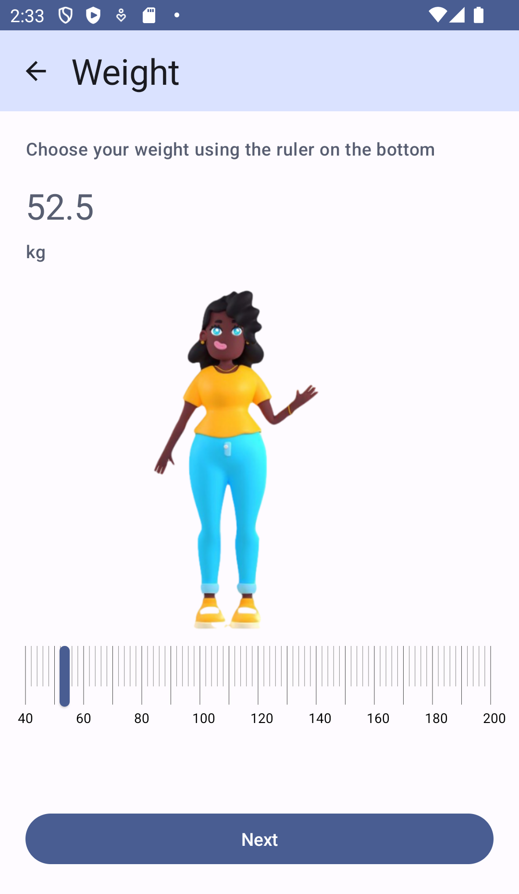
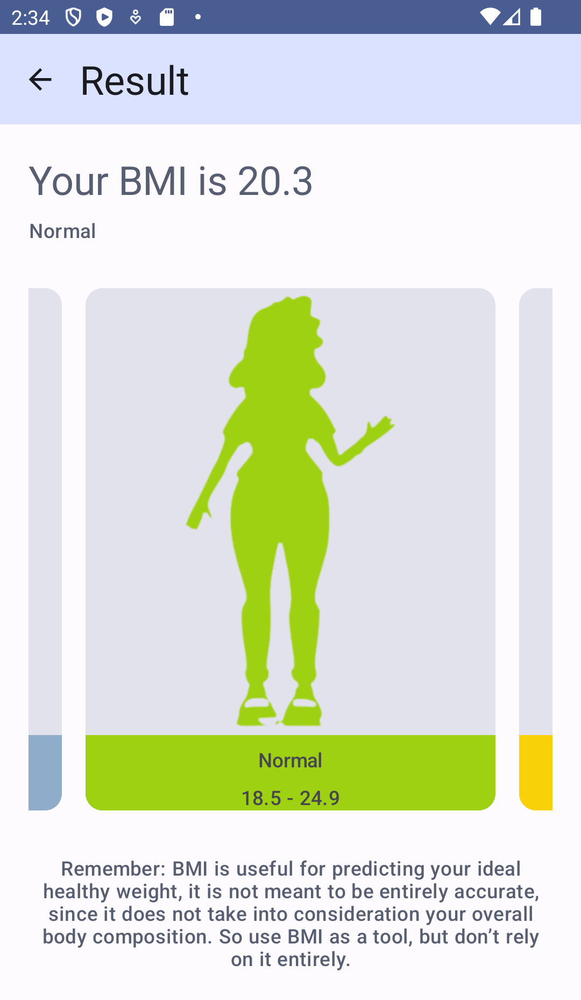
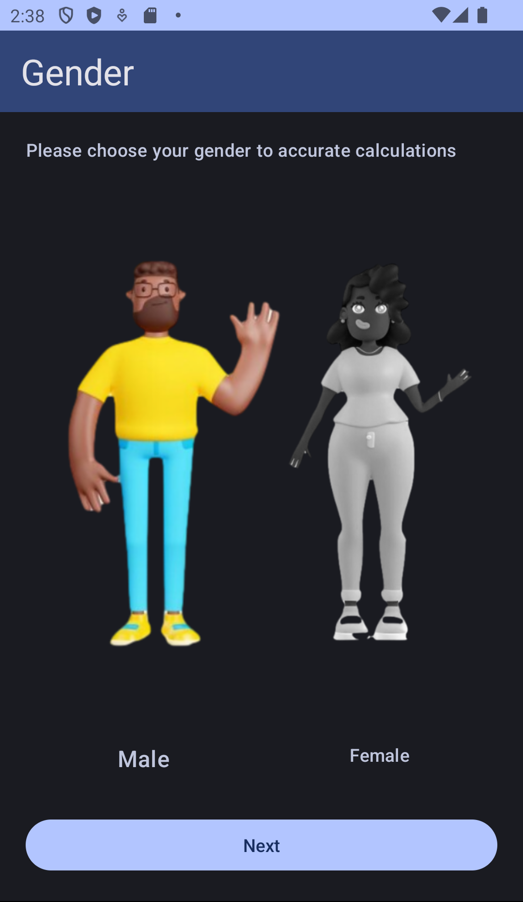
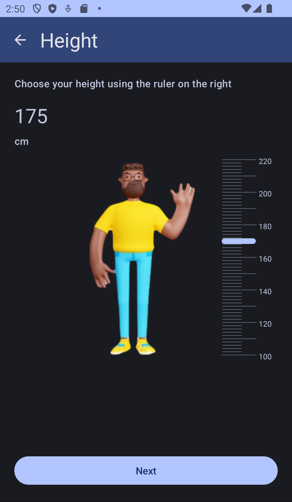
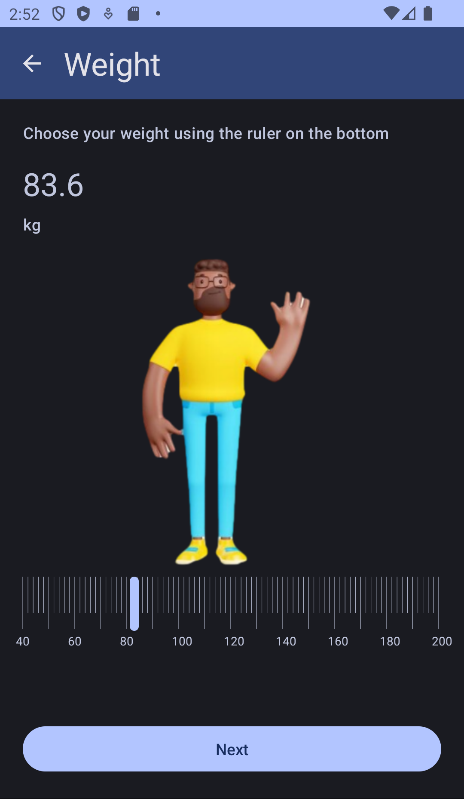
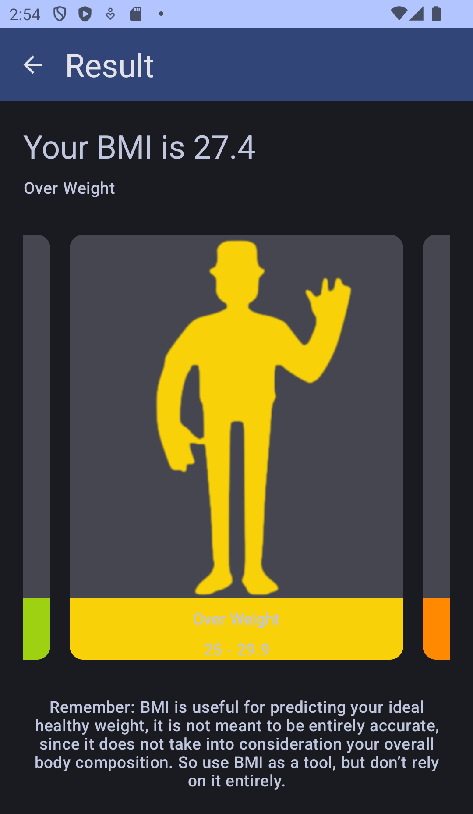

# BMI Calculator
Body Mass Index (BMI) Calculator.
The project was created using Jetpack Compose.
 - [Navigation](https://developer.android.com/jetpack/compose/navigation)
 - [Slider](https://m2.material.io/components/sliders/android#using-sliders) to define height and weight 
 - [Pager](https://developer.android.com/jetpack/compose/layouts/pager) in the result view.
 - [Google Play Instant](https://developer.android.com/topic/google-play-instant/overview)

## Screenshots
<table width="100%">
    <tr>
        <td width="25%"></td>
        <td width="25%"></td>
        <td width="25%"></td>
        <td width="25%"></td>
    </tr>
    <tr>
        <td width="25%"></td>
        <td width="25%"></td>
        <td width="25%"></td>
        <td width="25%"></td>
    </tr>
</table>

## Useful links
### CodeLabs
- [Jetpack Compose basics](https://developer.android.com/codelabs/jetpack-compose-basics)
- [Navigate between screens with Compose](https://developer.android.com/codelabs/basic-android-kotlin-compose-navigation)
- [Basic Layouts in Compose](https://developer.android.com/codelabs/jetpack-compose-layouts)
- [State in Jetpack Compose](https://developer.android.com/codelabs/jetpack-compose-state)
- [Theming in Compose with Material 3](https://developer.android.com/codelabs/jetpack-compose-theming)
- [Migrating to Jetpack Compose](https://developer.android.com/codelabs/jetpack-compose-migration)

### Android Developers Youtube Videos
- [Accelerate with tooling](https://youtu.be/8XJfLaAOxD0)
- [5 quick animation to make in your compose app](https://www.youtube.com/watch?v=0mfCbXrYBPE)
- [Migrate from View System to Compose](https://youtu.be/y10I6Suhvtc)

### Docs
- [Jetpack Compose for Android Developers](https://developer.android.com/courses/jetpack-compose/course)
- [Accessibility in Compose](https://developer.android.com/jetpack/compose/accessibility)
- [Semantics and TalkBack with Jetpack Compose](https://bryanherbst.com/2020/11/03/compose-semantics-talkback/)

### Other links or examples
- [Get free images](https://www.freepik.com/search?format=search&last_filter=ai&last_value=only&query=avatar%20body&selection=1&type=photo)
- [Customizing the slider](https://piotrprus.medium.com/custom-slider-in-jetpack-compose-43ed08e2c338)
- [Animations in Navigation Compose](https://medium.com/androiddevelopers/animations-in-navigation-compose-36d48870776b)
- [Body mass index (BMI)](https://www.nhsinform.scot/healthy-living/food-and-nutrition/healthy-eating-and-weight-loss/body-mass-index-bmi)
- [Why BMI is inaccurate and misleading](https://www.medicalnewstoday.com/articles/265215)
- [Use Play Console free machine translation service](https://play.google.com/console/developers/app/app-translation-embed)

### :books: Best Android Gists
- [Best Android Gists](https://github.com/lopspower/BestAndroidGists)


## License

```
Copyright 2023 PiardiLabs

Licensed under the Apache License, Version 2.0 (the "License");
you may not use this file except in compliance with the License.
You may obtain a copy of the License at

    https://www.apache.org/licenses/LICENSE-2.0

Unless required by applicable law or agreed to in writing, software
distributed under the License is distributed on an "AS IS" BASIS,
WITHOUT WARRANTIES OR CONDITIONS OF ANY KIND, either express or implied.
See the License for the specific language governing permissions and
limitations under the License.
```